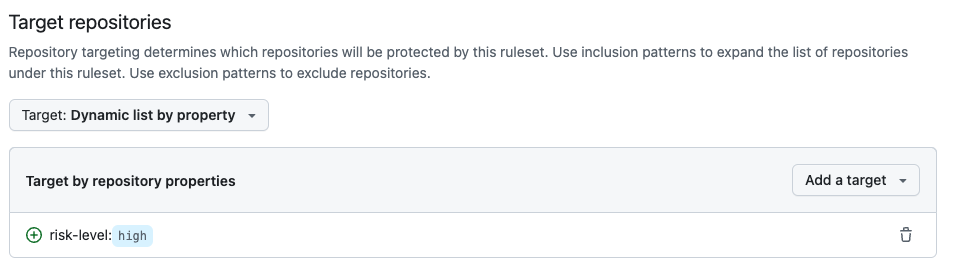
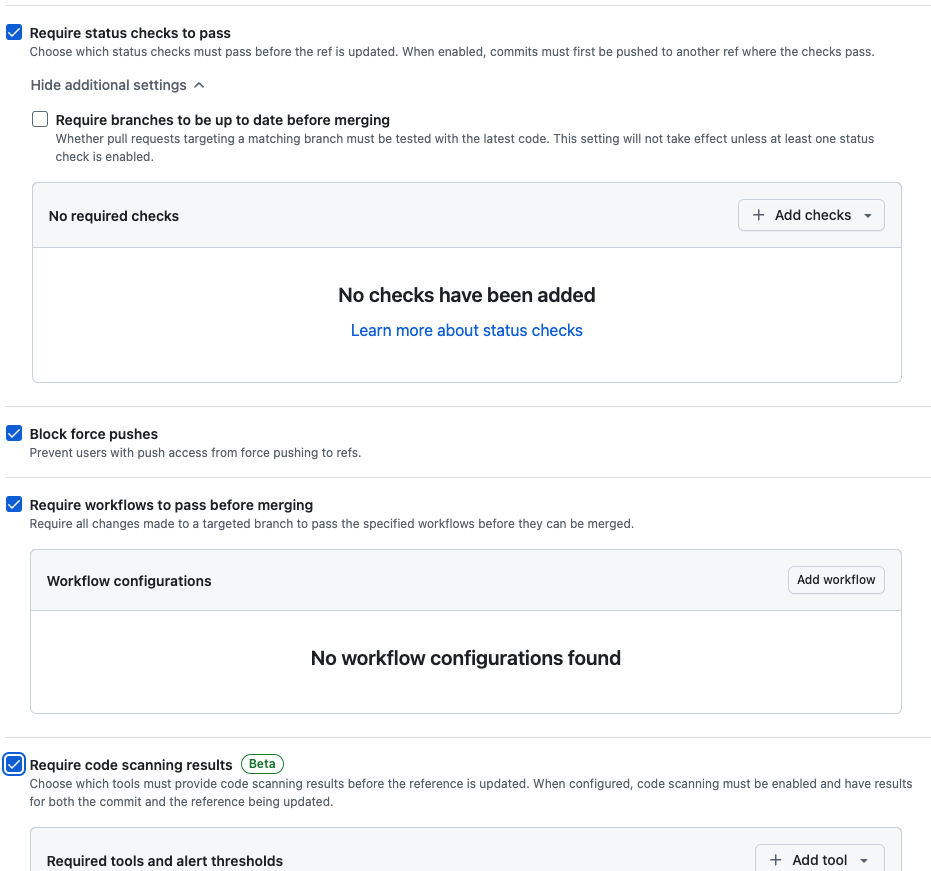

GitHub's Custom Properties allow you to add metadata to repositories in your organization. You can use those properties to target repositories with rulesets. Custom properties can be either single select (combo box) or free text. You can make custom properties required or optional for all repositories in your organization.

* [Managing custom properties for repositories in your organization](https://docs.github.com/en/organizations/managing-organization-settings/managing-custom-properties-for-repositories-in-your-organization#searching-and-filtering-repositories-by-custom-properties-values) - How you can set a custom property for your organization.
*  [REST API Endpoints for custom properties](https://docs.github.com/en/rest/repos/custom-properties?apiVersion=2022-11-28)  - You can use the REST API to view the custom properties that were assigned to a repository by the organization that owns the repository.
* [Repository Custom Properties GA and Ruleset Improvements](https://github.blog/changelog/2024-02-14-repository-custom-properties-ga-and-ruleset-improvements/) - There's a [good video here](https://www.youtube.com/watch?v=z0CYdcqZxyQ) that explains how to use custom properties and rulesets to manage your repositories.
* [Creating rulesets for repositories in your organization](https://docs.github.com/en/enterprise-cloud@latest/organizations/managing-organization-settings/creating-rulesets-for-repositories-in-your-organization) - By [combining rulesets with custom properties](https://docs.github.com/en/enterprise-cloud@latest/organizations/managing-organization-settings/creating-rulesets-for-repositories-in-your-organization#choosing-which-repositories-to-target-in-your-organization), you can define which policies apply to which repositories in your organization. Be sure to check out some of the [ruleset-recipes](https://github.com/github/ruleset-recipes) on GitHub you can import too!

# Example Script to pull custom properties from a repository

Using the GitHub API and with your GitHub personal access token run:

``` python
python3 custom-properties.py --repo <org>/<repo> --gh_pat <your_github_personal_access_token>
```

If you have custom properties in the repo, they will be printed to the console.

``` bash
Custom Property Key:Value Pairs for repo: swell-consulting/swiss-cheese
-------------------------------
risk-level: medium
```
# Combining Custom Properties with Rulesets - A simple example

Say you have a policy with these requirements:

* Identify all repositories that are considered high risk.
* Enforce the following rules on high risk repositories:
    - Require status checks to pass before merging
    - Block force pushes
    - Require workflows to pass before merging
    - Require code scanning results to pass before merging

Before custom properties and rulesets you'd have to identify each high risk repository and then apply these policies manually in branch protection rules and other configuration files. It's much easier now to enforce at an org level.

For this requirement we would:

1. Create an org-level custom property called `risk-level` with values `unset`, `low`, `medium`, and `high`. I like to flag on `unset` as the default so I can programatically check or enforce the property.
1. Set the `risk-level` property to `high` for all high risk repositories.
1. Create an org-level ruleset by from **Import a ruleset** and import: [one-ruleset-to-rule-them-all.yaml](https://github.com/github/ruleset-recipes/blob/main/branch-rulesets/org-rulesets/one-ruleset-to-rule-them-all.json). 
1. Choose the **Target repositories** option and select **Target: Dynamic list by property** and set the property to `risk-level` and the value to `high`. 
1. Review and enabled the **Rules** you want to enforce.
1. Profit!

The ruleset setting for the custom property selection and rule selection look like this:





