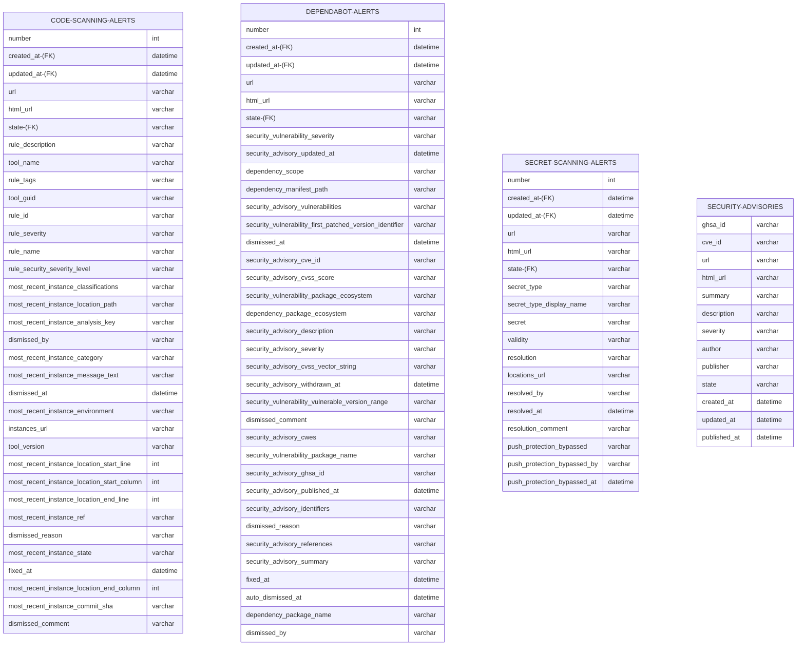

# Integrating GitHub Advanced Security Alerts into 3rd Party Reporting

## Introduction

GitHub Advanced Security Alerts provide valuable insights into the security posture of your codebase. However, it may be challening to understand the differences between the built-in Github Security reporting and what you may want to roll on your own as a 3rd party customization. This document attempts to provide:

* An overview of the Security Alert reporting provided at the Enterprise, Org, and Repo levels by GHAS.
* What types of security metrics, KPIs, and insights are commonly used by organizations.
* Which solution can provide the answers to these common metrics.

A successful rollout of any securty tool requires a clear understanding of the security metrics and KPIs that are important to your organization. 

## References

* [Integrating GitHub Advanced Security with third party reporting and analytics platforms](https://assets.ctfassets.net/wfutmusr1t3h/6Of080Yx7kpW0vdu6E38b1/d81bc4c11b9390ca37adeb9652ea3079/Integrating_GitHub_Advanced_Security_with_third_party_reporting_and_analytics_platforms.pdf). Github, September 2022. This white paper details some of the integration options for pulling GHAS secuirty alerts, but does not provide a comparasion to any of the built in Security reporting.

## Out of scope

This document does not cover the following:

* Audit logs or SIEM integrations
* GraphQL API
* Web hooks

These may be alternative technical solutions to arrive at the insights you are wishing to obtain for security alert reporting.

## Types of GHAS Security Alerts

GitHub Advanced Security provides four types of alerts:

1. **Dependabot Alerts**: These alerts provide information about dependencies that have known vulnerabilities.
1. **Secrets Alerts**: These alerts are triggered when potentially sensitive information, like passwords or API keys, are committed to the repository.
1. **Code Alerts**: These alerts are generated from CodeQL, GitHub's semantic code analysis engine, which can identify complex code patterns that could lead to vulnerabilities.
1. **Security Advisories**: These are publicly disclosed security vulnerabilities in repositories that use GitHub for distribution.

## Built-in Security Reporting

GitHub provides built-in reporting at the Enterprise, Organization, and Repository levels. The visibility of these reports is controlled by the user's role:

| Level               | Description                                      | Roles Required                                |
|---------------------|--------------------------------------------------|-----------------------------------------------|
| [Enterprise Level](https://docs.github.com/en/enterprise-cloud@latest/code-security/security-overview/about-security-overview#enterprise-level-overview)    | Enterprise roll-up only for orgs that have enabled GHAS. (Enterprise license required) | Enterprise owners, billing managers, security managers           |
| [Organization Level](https://docs.github.com/en/enterprise-cloud@latest/code-security/security-overview/about-security-overview#organization-level-overview)  | Org-level aggregation only for orgs that have enabled GHAS. (Enterprise license required) | Organization owners, team maintainers        |
| Repository Level    | Only raw alerts for all alert types                     | Repository admins, security managers                             |

# Security Alert Metrics

These are some common security metrics, KPIs, and insights that can be gleaned from the GHAS security alerts.

## Raw Alert Data Schemas

It's useful to be able to understand what data is available to you to ensure you can answer the questions you want. Some questions will be easily answerable with the Security Overview reporting, while other questions may require you to pull the raw data and perform your own analysis.

**Note:** In the following ER diagram, names with '-(FK)' suffix denote items that can be used as a foreign key.

**Note:** The fields `dismissed_by`, `dismissed_comment`, `fixed_at`, and `dismissed_reason`, can be normalized for Code Scanning Alerts and Dependabot Alerts, but not Secret scanning alerts. For normalizing joins with Secret Alerts with Code/Dependabot alerts, you can use secret alert fields `resolved_by`, `resolution_comment`, and `resolved_at` respectively.

## Code Scanning Alert Metrics

| Metric | Description | SQL Example | Available in GitHub Security Reporting |
| --- | --- | --- | --- |
| Count of Current Open Findings | The total number of unresolved code scanning alerts. | `SELECT COUNT(*) FROM code_scanning_alerts WHERE state = 'open';` | ✅ |
| [Alert count for all repos](https://docs.github.com/en/enterprise-cloud@latest/code-security/security-overview/viewing-security-insights-for-your-organization#viewing-the-security-overview-dashboard) | The total number of resolved or unresolved code scanning alerts across all repositories. | `SELECT COUNT(*) FROM code_scanning_alerts WHERE state = 'open';` | ⚠️ - Only a Org level, not Enterprise level |
| [Count of New Findings Over Time](https://docs.github.com/en/enterprise-cloud@latest/code-security/security-overview/viewing-security-insights-for-your-organization#viewing-the-security-overview-dashboard) | The number of new alerts created within a specific time period. | `SELECT COUNT(*) FROM code_scanning_alerts WHERE created_at BETWEEN date1 AND date2;` | ⚠️ - Org level only (Beta) with cumulative flow graph |
| [New Events Plotted on a Timeline](https://docs.github.com/en/enterprise-cloud@latest/code-security/security-overview/viewing-security-insights-for-your-organization#viewing-the-security-overview-dashboard) | A timeline of when new alerts were created. | `SELECT created_at, COUNT(*) FROM code_scanning_alerts GROUP BY created_at;` | ⚠️ - Org level only (Beta) with cumulative flow graph you can deduce new alerts added |
| [Count of Closed Findings Over Time](https://docs.github.com/en/enterprise-cloud@latest/code-security/security-overview/viewing-security-insights-for-your-organization#viewing-the-security-overview-dashboard) | The number of alerts closed within a specific time period. | `SELECT COUNT(*) FROM code_scanning_alerts WHERE state = 'closed' AND closed_at BETWEEN date1 AND date2;` | ⚠️ - Org level only (Beta) |
| [Closed Events Plotted on a Timeline](https://docs.github.com/en/enterprise-cloud@latest/code-security/security-overview/viewing-security-insights-for-your-organization#viewing-the-security-overview-dashboard) | A timeline of when alerts were closed. | `SELECT closed_at, COUNT(*) FROM code_scanning_alerts WHERE state = 'closed' GROUP BY closed_at;` | ⚠️ - Org level only (Beta) |
| [Mean Time to Resolution](https://docs.github.com/en/enterprise-cloud@latest/code-security/security-overview/viewing-security-insights-for-your-organization#mean-time-to-remediate) | The average time it takes to close an alert. | `SELECT AVG(DATEDIFF(closed_at, created_at)) FROM code_scanning_alerts WHERE state = 'closed';` | ⚠️ - Org level only (Beta) |
| Resolution Duration Averaged Over a Time Period | The average time it takes to close an alert within a specific time period. | `SELECT AVG(DATEDIFF(closed_at, created_at)) FROM code_scanning_alerts WHERE state = 'closed' AND closed_at BETWEEN date1 AND date2;` | ⚠️ - Org level only (Beta) |
| Count by Severity | The number of alerts grouped by severity level. | `SELECT severity, COUNT(*) FROM code_scanning_alerts GROUP BY severity;` | ✅ |
| Count by Organization | The number of alerts grouped by organization. | `SELECT organization, COUNT(*) FROM code_scanning_alerts GROUP BY organization;` | ✅ |
| Count by Repository | The number of alerts grouped by repository. | `SELECT repository, COUNT(*) FROM code_scanning_alerts GROUP BY repository;` | ✅ |
| Count by Tool Name | The number of alerts grouped by the tool that generated them. | `SELECT tool_name, COUNT(*) FROM code_scanning_alerts GROUP BY tool_name;` | ✅ |
| Count by Rule | The number of alerts grouped by the rule that triggered them. | `SELECT rule_id, COUNT(*) FROM code_scanning_alerts GROUP BY rule_id;` | ❌ |
| Count by Dismissed Reason | The number of alerts grouped by the reason they were dismissed. | `SELECT dismissed_reason, COUNT(*) FROM code_scanning_alerts WHERE state = 'dismissed' GROUP BY dismissed_reason;` | ❌ |
| Count by Language | The number of alerts grouped by the programming language of the repository. | `SELECT language, COUNT(*) FROM code_scanning_alerts GROUP BY language;` | ❌ |
| Alerts Out of SLA | The number of alerts that have been open for longer than the defined SLA. | `SELECT COUNT(*) FROM code_scanning_alerts WHERE state = 'open' AND DATEDIFF(NOW(), created_at) > SLA_days;` | ❌ |
| Percent of SLA Obtainment by Severity | The percentage of open alerts for each severity level that have been resolved within the defined SLA. | `SELECT severity, (COUNT(*) - SUM(CASE WHEN DATEDIFF(NOW(), created_at) > SLA_days THEN 1 ELSE 0 END)) / COUNT(*) * 100 FROM code_scanning_alerts WHERE state = 'open' GROUP BY severity;` | ❌ |

## Secret Scanning Alert Metrics

| Metric | Description | SQL Example | Available in GitHub Security Reporting |
| --- | --- | --- | --- |
| Count of Current Open Secrets | The total number of unresolved secret scanning alerts. | `SELECT COUNT(*) FROM secret_scanning_alerts WHERE state = 'open';` | ✅ |
| Total Count Across all Repositories of Secrets in an Open State | The total number of unresolved secret scanning alerts across all repositories. | `SELECT COUNT(*) FROM secret_scanning_alerts WHERE state = 'open';` |  ✅ |
| Count of Opened Secrets Over Time | The number of new alerts created within a specific time period. | `SELECT COUNT(*) FROM secret_scanning_alerts WHERE created_at BETWEEN date1 AND date2;` | ⚠️ - Org level only (Beta) |
| Open Events Plotted on a Timeline | A timeline of when new alerts were created. | `SELECT created_at, COUNT(*) FROM secret_scanning_alerts GROUP BY created_at;` | ⚠️ - Org level only (Beta) |
| Count of Closed Secrets Over Time | The number of alerts closed within a specific time period. | `SELECT COUNT(*) FROM secret_scanning_alerts WHERE state = 'closed' AND closed_at BETWEEN date1 AND date2;` | ⚠️ - Org level only (Beta) |
| Closed Events Plotted on a Timeline | A timeline of when alerts were closed. | `SELECT closed_at, COUNT(*) FROM secret_scanning_alerts WHERE state = 'closed' GROUP BY closed_at;` | ⚠️ - Org level only (Beta) |
| Mean Time to Resolution | The average time it takes to close an alert. | `SELECT AVG(DATEDIFF(closed_at, created_at)) FROM secret_scanning_alerts WHERE state = 'closed';` | ⚠️ - Org level only (Beta) |
| Resolution Duration Averaged Over a Time Period | The average time it takes to close an alert within a specific time period. | `SELECT AVG(DATEDIFF(closed_at, created_at)) FROM secret_scanning_alerts WHERE state = 'closed' AND closed_at BETWEEN date1 AND date2;` | ⚠️ - Org level only (Beta) |
| Count by Resolution Type | The number of alerts grouped by resolution type. | `SELECT resolution_type, COUNT(*) FROM secret_scanning_alerts GROUP BY resolution_type;` | ✅ |
| Count by Secret Type | The number of alerts grouped by the type of secret. | `SELECT secret_type, COUNT(*) FROM secret_scanning_alerts GROUP BY secret_type;` | ⚠️ - limited to provider-pattern or custom-pattern |
| Count by Repository | The number of secret alerts grouped by repository. | `SELECT repository, COUNT(*) FROM secret_scanning_alerts GROUP BY repository;` | ✅ - Org level only |
| Count by Organization | The number of alerts grouped by organization. | `SELECT organization, COUNT(*) FROM secret_scanning_alerts GROUP BY organization;` | ✅ |
| Count of Push Protection Events | The number of times push protection was bypassed, secret blocked, and total secrets blocked. | `SELECT COUNT(*) FROM secret_scanning_alerts WHERE push_protection_bypassed = 'Yes';` | ✅ |

## Dependabot Alert Metrics

| Metric | Description | SQL Example | Available in GitHub Security Reporting |
| --- | --- | --- | --- |
| Count of Current Open Vulnerabilities | The total number of unresolved Dependabot alerts. | `SELECT COUNT(*) FROM dependabot_alerts WHERE state = 'open';` | ✅ |
| Total vulnerabities across all repos of an org | The total number of unresolved Dependabot alerts across all repositories. | `SELECT COUNT(*) FROM dependabot_alerts WHERE state = 'open';` | ✅ |
| Count of Opened Vulnerabilities Over Time | The number of new alerts created within a specific time period. | `SELECT COUNT(*) FROM dependabot_alerts WHERE created_at BETWEEN date1 AND date2;` | No |
| Open Events Plotted on a Timeline | A timeline of when new alerts were created. | `SELECT created_at, COUNT(*) FROM dependabot_alerts GROUP BY created_at;` | No |
| Count of Closed Vulnerabilities Over Time | The number of alerts closed within a specific time period. | `SELECT COUNT(*) FROM dependabot_alerts WHERE state = 'closed' AND closed_at BETWEEN date1 AND date2;` | No |
| Closed Events Plotted on a Timeline | A timeline of when alerts were closed. | `SELECT closed_at, COUNT(*) FROM dependabot_alerts WHERE state = 'closed' GROUP BY closed_at;` | No |
| Mean Time to Resolution | The average time it takes to close an alert. | `SELECT AVG(DATEDIFF(closed_at, created_at)) FROM dependabot_alerts WHERE state = 'closed';` | No |
| Resolution Duration Averaged Over a Time Period | The average time it takes to close an alert within a specific time period. | `SELECT AVG(DATEDIFF(closed_at, created_at)) FROM dependabot_alerts WHERE state = 'closed' AND closed_at BETWEEN date1 AND date2;` | No |
| Count by Severity | The number of alerts grouped by severity level. | `SELECT severity, COUNT(*) FROM dependabot_alerts GROUP BY severity;` | Yes |
| Count by Repository | The number of alerts grouped by repository. | `SELECT repository, COUNT(*) FROM dependabot_alerts GROUP BY repository;` | Yes |
| Count by Organization | The number of alerts grouped by organization. | `SELECT organization, COUNT(*) FROM dependabot_alerts GROUP BY organization;` | Yes |

## Security Advisory Metrics

| Metric | Description | SQL Example | Available in GitHub Security Reporting |
| --- | --- | --- | --- |
| Count of Current Open Advisories | The total number of unresolved security advisories. | `SELECT COUNT(*) FROM security_advisories WHERE state = 'open';` | Yes |
| Count of Advisories Over Time | The number of new advisories created within a specific time period. | `SELECT COUNT(*) FROM security_advisories WHERE created_at BETWEEN date1 AND date2;` | No |
| Open Advisories Plotted on a Timeline | A timeline of when new advisories were created. | `SELECT created_at, COUNT(*) FROM security_advisories GROUP BY created_at;` | No |
| Count of Closed Advisories Over Time | The number of advisories closed within a specific time period. | `SELECT COUNT(*) FROM security_advisories WHERE state = 'closed' AND updated_at BETWEEN date1 AND date2;` | No |
| Closed Advisories Plotted on a Timeline | A timeline of when advisories were closed. | `SELECT updated_at, COUNT(*) FROM security_advisories WHERE state = 'closed' GROUP BY updated_at;` | No |
| Mean Time to Resolution | The average time it takes to close an advisory. | `SELECT AVG(DATEDIFF(updated_at, created_at)) FROM security_advisories WHERE state = 'closed';` | No |
| Count by Severity | The number of advisories grouped by severity level. | `SELECT severity, COUNT(*) FROM security_advisories GROUP BY severity;` | Yes |
| Count by Author | The number of advisories grouped by author. | `SELECT author, COUNT(*) FROM security_advisories GROUP BY author;` | Yes |
| Count by Publisher | The number of advisories grouped by publisher. | `SELECT publisher, COUNT(*) FROM security_advisories GROUP BY publisher;` | Yes |