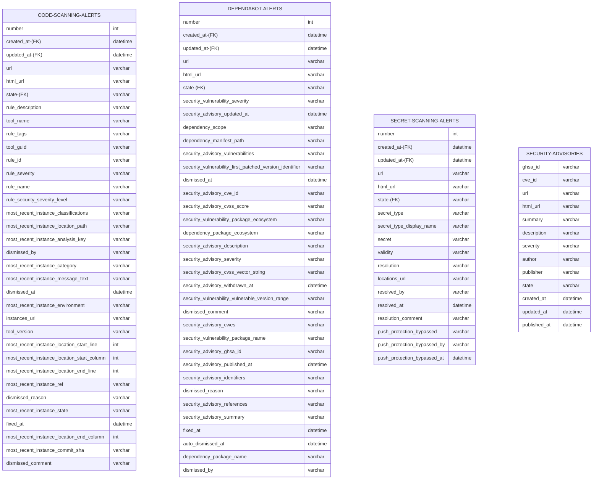

**Note:** In the following ER diagram, names with '-(FK)' suffix denote items that can be used as a foreign key.

**Note:** The fields `dismissed_by`, `dismissed_comment`, `fixed_at`, and `dismissed_reason`, can be normalized for Code Scanning Alerts and Dependabot Alerts, but not Secret scanning alerts. For normalizing joins with Secret Alerts with Code/Dependabot alerts, you can use secret alert fields `resolved_by`, `resolution_comment`, and `resolved_at` respectively.

