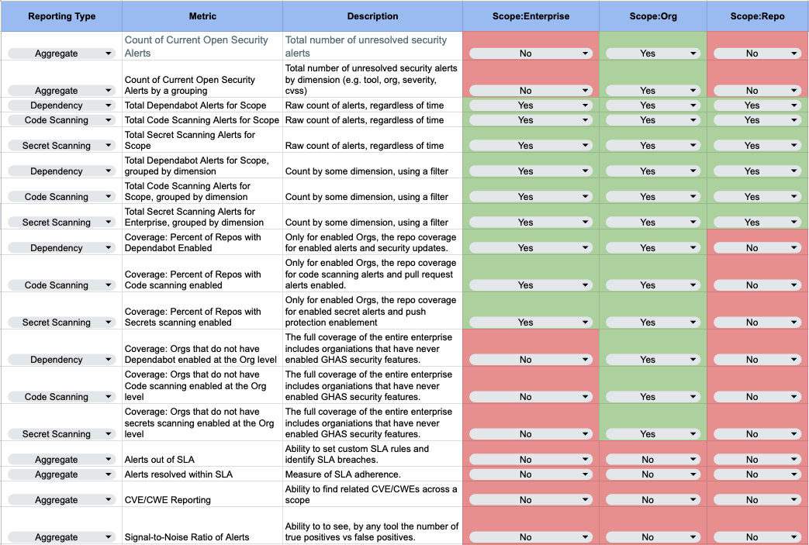

# Implementing a GitHub Advanced Security Reporting Strategy

> **Note:** Security Overview reporting is only available for Enterprise Cloud customers.

## Introduction

The GitHub Advanced Security (GHAS) suite of tools provides valuable analysis and reporting into the security posture of your codebase. Multiple tools form the GHAS suite including Code Scanning, Dependabot (Vulnerably Analysis), Secret Scanning, and Security Advisories. Each of these tools provides a unique set of security alerts and reporting that can be used to find and remediate security vulnerabilities in your code. As with any security tool, monitoring and measuring the performance of security alerts is key to its success. 

This article will provide an overview of steps you can take to build your own security reporting strategy using the GHAS Security Overview and Alert reporting as well as considerations for building your own custom reporting. We'll start our GHAS reporting strategy with four primary questions to answer before you formalize a strategy and begin to build, report, and act on your security alerts.

* [What questions are you trying to answer?](#what-questions-are-you-trying-to-answer)
* [What GHAS reporting exists to answer these questions?](#what-ghas-reporting-exists-to-answer-these-questions)
* [Who has access to the built-in GHAS reporting?](#who-has-access-to-the-built-in-ghas-reporting)
* [Do we need to consider any custom reporting?](#do-we-need-to-consider-any-custom-reporting)

The article will help you devise a strategy to quickly answer these questions. However, before we start, you should be aware of some references that are part of the scope of this article.

## References

This document assumes you familiar with these concepts. If you are not, you may want to review these references before continuing.

* [Integrating GitHub Advanced Security with third party reporting and analytics platforms](https://resources.github.com/security/integrating-github-advanced-security-with-third-party-platforms/). Github, September 2022. This white paper details the tooling options for building custom reporting such as APIs and Webhooks. It also includes some common metrics you may want to consider for your own reporting strategy.
* [Security Overview](https://docs.github.com/en/enterprise-cloud@latest/code-security/security-overview/about-security-overview) - This would be required reading for understanding the breadth of features and reporting available in GHAS.

# Strategic Understanding

## What questions are you trying to answer?

The first step in building a reporting strategy is to formulate the questions you want to answer. For example, you may be interested in understanding the net flow of critical code scanning alerts. Or you may want to track the SLA adherence for critical vulnerabilities reported in dependabot to ensure critical dependencies are patched on time. There is no one-size-fits-all answer to this question, rather it depends on the goals of the organization and what you are trying to control. Do you want to ensure all your repositories are compliant? Do you want to send alerts to teams that are not meeting SLAs? Again, this will be entirely dependent on what is important to your own organization.

### Who are the questions for?

The second level of any question is the target audience. Consider the audience for each question. Is this a board-level metrics? Does a Github team need their own insights? Is this for quarterly executive updates? Who handles monitoring specific metrics and acting upon them?

### Make sure your insights are actionable!

While some reporting can give us an idea of the volume of alerts coming through, that alone is likely not important. Be sure you differentiate between reporting and insights: an insight is a piece of information that can be used directly to take some sort of action. 

For example, consider secrets push protection feature and a generated insight. The action would be an identified owner to take the following action:

* Review the push protection bypassed alert.
* Decide if the bypass is a valid secret or not.
* If a valid secret, work with the developer to remove the secret from the codebase and rotate the secret.
* If it's a legitimate bypass, consider other bypass patterns and if you can build exclusion roles (e.g., for unit tests).

## What GHAS reporting exists to answer these questions?

The next step in building a reporting strategy is to understand what reporting is available to you "out-of-the-box". Github Advanced Security has excellent reporting capabilities documented (see References). It can be difficult to get a "bird's eye view" of the reporting feature across Enterprise, Organization, and Repository scopes. I've built a template in a Google Sheet, [GHAS Security Reporting Capabilities](https://docs.google.com/spreadsheets/d/1gZz0dPl6jLYyNqhglIyzkoy-oq_Q38wh3xx6_WKW8sg/edit#gid=0) which offers a flattened view of what metrics are available for each scope. A scope is defined as the ownership level: Enterprise, Organization, or Repository. By comparing your own questions and desired insights against existing capabilities you can get a quick glimpse of what you can get out-of-the-box versus what you would need to build custom reporting for.

## Who has access to the built-in GHAS reporting?

Once you know the level of built-in reporting by scopes, you need to decide who gets access to reporting. This is generally described in the [Permission to view data in security overview](https://docs.github.com/en/enterprise-cloud@latest/code-security/security-overview/about-security-overview#permission-to-view-data-in-security-overview), however I offer a flattened view of all the permissions in [Security Reporting Permissions](https://docs.google.com/spreadsheets/d/1gZz0dPl6jLYyNqhglIyzkoy-oq_Q38wh3xx6_WKW8sg/edit#gid=486941505) (a Google Sheet).

Understanding who needs access will help you build your report visibility strategy for those edge cases where stakeholders may not have default access. Using the [Security Manager role in Github](https://docs.github.com/en/organizations/managing-peoples-access-to-your-organization-with-roles/managing-security-managers-in-your-organization) is a great way to allow non-admins and owners visibility to Security reporting and alerts.

## Do we need to consider any custom reporting?

At the last stage, we should have a fairly good idea of the insights we need, what we can get out of the box, and who needs access to them. You can now perform a gap analysis and decide if the ROI is of value to build custom reporting. I'm assuming you will use the REST API to retrieve data to build custom reporting, or leverage Webhooks to push data to a third-party reporting tool or SIEM.

### Leverage Existing Analytics & Reporting Infrastructure

Some considerations that may help you accelerate your custom reporting strategy technical rollout:

* Do you have an existing data warehouse or data lake that can be used to store and report on GHAS data?
* Are there existing design patterns for building data pipelines for data transformation and ingest?
* Does your organization run a SIEM that can be used to ingest GHAS data?
* At what frequency do you need the data?
* What does the freshness of your data need to be? (Hourly, Daily, Weekly?)
* What data visualization tools are available to you?

### Evaluate the Github Alert Schemas

Knowing your schema is critical to review against what you want to report on. Github does not publish a known schema, but it can be easily derived from the REST API. I've offered a flattened view of the schema in this Google Sheet: [Security Alerts REST Response Schema](hhttps://docs.google.com/spreadsheets/d/1gZz0dPl6jLYyNqhglIyzkoy-oq_Q38wh3xx6_WKW8sg/edit#gid=1731893230). Here you can see what data and types are available to you. 

An entity relationship (ER) diagram of the schemas is available below:

> **Note:** In the following ER diagram, names with `-(FK)` suffix denote items that can be used as a foreign key.

> **Note:** The fields `dismissed_by`, `dismissed_comment`, `fixed_at`, and `dismissed_reason`, can be normalized for Code Scanning Alerts and Dependabot Alerts, but not Secret scanning alerts. For normalizing joins with Secret Alerts with Code/Dependabot alerts, you can use secret alert fields `resolved_by`, `resolution_comment`, and `resolved_at` respectively.

### Protype your Custom Reporting!

Finally, once you have done a thorough evaluation, start scripting your custom reporting solution. Make sure you understand the data schema and temporal nature of the data to pull the actionable insights you need!

Keep on hacking!

