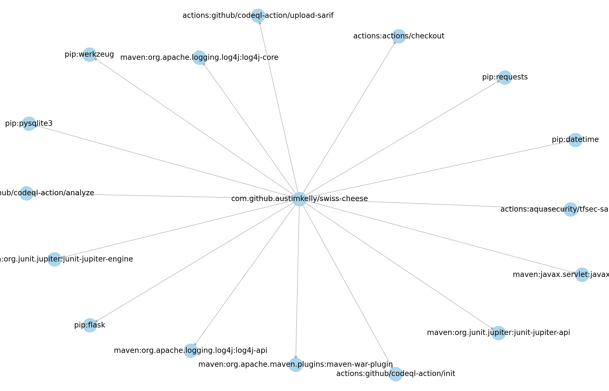

This is a quick and dirty script to parse SBOM data downloaded from a single Github repository.

# Steps

1. Download SBOM data from Github. Reference: [Downloading an SBOM for your repository](https://docs.github.com/en/code-security/supply-chain-security/understanding-your-software-supply-chain/exporting-a-software-bill-of-materials-for-your-repository)
2. Install dependencies: `pip install networkx matplotlib`
3. Run the script: `python3 sbom-viz.py <path-to-sbom-json-file>`

The example file [sbom-example.json](./sbom-example.json) is included in this repository.

